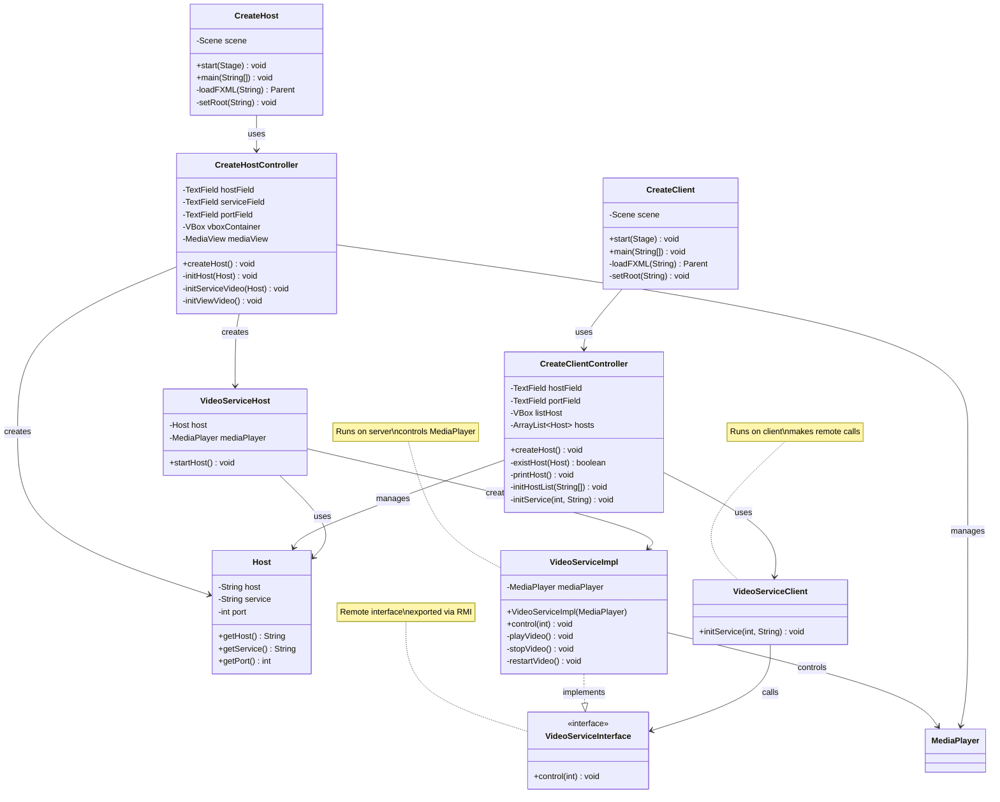

# 🎬 StreamSetup

<div align="center">


**Configure seu servidor de vídeo de forma descomplicada**

[Características](#-características) • [Instalação](#-instalação) • [Uso](#-como-usar) • [Arquitetura](#-arquitetura) • [API](#-api-rmi) • [FAQ](#-faq)

</div>

---

## 📖 Sobre o Projeto

StreamSetup é uma aplicação distribuída desenvolvida em Java que demonstra o uso de **RMI (Remote Method Invocation)** para controle remoto de reprodução de vídeo. O sistema segue a arquitetura cliente-servidor, onde um servidor hospeda e reproduz o vídeo localmente, enquanto múltiplos clientes podem controlar a reprodução remotamente através de uma interface gráfica moderna construída com JavaFX.

### 🎯 Objetivos

- Demonstrar conceitos de programação distribuída com Java RMI
- Implementar comunicação cliente-servidor robusta
- Proporcionar interface de usuário moderna e intuitiva
- Aplicar padrões de design e boas práticas de desenvolvimento

### 💡 Casos de Uso

- **Educacional**: Aprendizado de RMI e sistemas distribuídos
- **Apresentações**: Controle remoto de vídeos em salas de aula/conferências
- **Demo**: Demonstração de arquitetura cliente-servidor
- **Prototipagem**: Base para sistemas de streaming mais complexos

---

## ✨ Características

### Funcionalidades Principais

- 🎥 **Streaming de Vídeo Local**: Reprodução de arquivos MP4 com controle de qualidade
- 🎮 **Controle Remoto**: Operações Start, Stop e Restart via RMI
- 🌐 **Multi-Host**: Suporte a conexão com múltiplos servidores simultâneos
- 🔄 **Sincronização**: Controle em tempo real do estado do vídeo
- 📡 **Discovery Dinâmico**: Busca automática de serviços RMI disponíveis
- 💫 **UI/UX Moderno**: Interface dark mode com animações fluidas

### Características Técnicas

- ⚡ **Assíncrono**: Operações não-bloqueantes com JavaFX Platform
- 🔌 **Configurável**: Portas e endereços customizáveis
- 🛡️ **Tratamento de Erros**: Sistema robusto de exceções
- 🎨 **Tema Dark**: Interface otimizada para uso prolongado
- 📦 **Modular**: Arquitetura separada em camadas (MVC)

---

## 🚀 Tecnologias

| Tecnologia | Versão | Descrição |
|------------|--------|-----------|
| **Java** | 17+ | Linguagem de programação |
| **JavaFX** | 17+ | Framework para interface gráfica |
| **Java RMI** | Built-in | Sistema de invocação remota |
| **Lombok** | 1.18.30 | Redução de boilerplate code |
| **Maven** | 3.6+ | Gerenciamento de dependências |
| **FXML** | - | Definição declarativa de UI |
| **CSS3** | - | Estilização da interface |

---

## 📋 Pré-requisitos

### Obrigatórios

- ☕ **JDK 17** ou superior ([Download](https://www.oracle.com/java/technologies/downloads/))
- 📦 **Maven 3.6+** ([Download](https://maven.apache.org/download.cgi))
- 🎬 **Arquivo de vídeo** MP4 (codec H.264 recomendado)

### Recomendados

- 💻 IDE com suporte JavaFX (IntelliJ IDEA, Eclipse, VS Code)
- 🔧 Plugin Lombok configurado na IDE
- 🌐 Conexão de rede (para teste remoto)

### Especificações Mínimas

- **RAM**: 512 MB disponível
- **CPU**: Dual-core 2.0 GHz
- **Disco**: 100 MB de espaço livre
- **SO**: Windows 10+, Linux (Kernel 4.0+), macOS 10.14+

---

## 🛠️ Instalação

### 1️⃣ Clone o Repositório

```bash
git clone https://github.com/seu-usuario/streamsetup.git
cd streamsetup
```

### 2️⃣ Configure o POM.xml

Verifique se todas as dependências estão corretas:

```xml
<properties>
    <maven.compiler.source>17</maven.compiler.source>
    <maven.compiler.target>17</maven.compiler.target>
    <javafx.version>17</javafx.version>
</properties>

<dependencies>
    <!-- JavaFX -->
    <dependency>
        <groupId>org.openjfx</groupId>
        <artifactId>javafx-controls</artifactId>
        <version>${javafx.version}</version>
    </dependency>
    <dependency>
        <groupId>org.openjfx</groupId>
        <artifactId>javafx-fxml</artifactId>
        <version>${javafx.version}</version>
    </dependency>
    <dependency>
        <groupId>org.openjfx</groupId>
        <artifactId>javafx-media</artifactId>
        <version>${javafx.version}</version>
    </dependency>
    
    <!-- Lombok -->
    <dependency>
        <groupId>org.projectlombok</groupId>
        <artifactId>lombok</artifactId>
        <version>1.18.30</version>
        <scope>provided</scope>
    </dependency>
</dependencies>
```

### 3️⃣ Compile o Projeto

```bash
mvn clean install
```

### 4️⃣ Adicione seu Vídeo

Coloque um arquivo de vídeo MP4 em:
```
src/main/resources/video.mp4
```

**Recomendações para o vídeo:**
- Formato: MP4 (H.264)
- Resolução: 720p ou 1080p
- Taxa de bits: 2-5 Mbps
- Duração: Qualquer
- Tamanho: Máximo 500MB para melhor performance

---

## 🎯 Como Usar

### 🖥️ Modo Servidor (Host)

#### Passo 1: Iniciar o Servidor

**Via Maven:**
```bash
mvn javafx:run -Djavafx.mainClass=com.CreateHost
```

**Via JAR:**
```bash
java -jar target/streamsetup-host.jar
```

**Via IDE:**
- Execute a classe `com.CreateHost`

#### Passo 2: Configurar o Host

| Campo | Descrição | Exemplo | Obrigatório |
|-------|-----------|---------|-------------|
| **Endereço Host** | IP ou hostname da máquina servidor | `localhost` ou `192.168.1.10` | ✅ |
| **ID do Serviço** | Nome único do serviço RMI | `VideoStreamRemoto` | ✅ |
| **Porta** | Porta do RMI Registry | `1099` (padrão) | ✅ |

#### Passo 3: Criar o Host

1. Preencha todos os campos
2. Clique em **"Criar Host"**
3. O vídeo será carregado no player
4. O servidor RMI ficará aguardando conexões

**Indicadores de Status:**
- ✅ Verde: Host criado com sucesso
- ❌ Vermelho: Erro na criação
- 🔵 Azul: Processando

---

### 💻 Modo Cliente

#### Passo 1: Iniciar o Cliente

**Via Maven:**
```bash
mvn javafx:run -Djavafx.mainClass=com.CreateClient
```

**Via JAR:**
```bash
java -jar target/streamsetup-client.jar
```

**Via IDE:**
- Execute a classe `com.CreateClient`

#### Passo 2: Conectar ao Servidor

| Campo | Descrição | Exemplo |
|-------|-----------|---------|
| **Endereço Host** | IP do servidor | `192.168.1.10` |
| **Porta** | Porta RMI do servidor | `1099` |

#### Passo 3: Buscar Hosts

1. Preencha o endereço e porta
2. Clique em **"Buscar Host"**
3. Serviços disponíveis aparecerão na lista

#### Passo 4: Controlar o Vídeo

Para cada host conectado, você terá três botões:

| Botão | Ação | Descrição |
|-------|------|-----------|
| **▶️ Start** | Iniciar/Retomar | Inicia a reprodução ou retoma se pausado |
| **⏸️ Stop** | Pausar | Pausa o vídeo no frame atual |
| **🔄 Restart** | Reiniciar | Volta ao início e inicia reprodução |

---

## 🏗️ Arquitetura

### Diagrama de Classes



### Fluxo de Comunicação

```
┌─────────────┐                    ┌─────────────┐
│   Cliente   │                    │   Servidor  │
│   (Client)  │                    │    (Host)   │
└──────┬──────┘                    └──────┬──────┘
       │                                  │
       │  1. Naming.list()                │
       │─────────────────────────────────>│
       │                                  │
       │  2. Lista de serviços RMI        │
       │<─────────────────────────────────│
       │                                  │
       │  3. Naming.lookup(serviceName)   │
       │─────────────────────────────────>│
       │                                  │
       │  4. Stub do serviço              │
       │<─────────────────────────────────│
       │                                  │
       │  5. service.control(comando)     │
       │─────────────────────────────────>│
       │                                  │
       │                                  │ 6. Executa ação
       │                                  │    no MediaPlayer
       │                                  │
       │  7. Confirmação/Resultado        │
       │<─────────────────────────────────│
       │                                  │
```

### Padrões de Design Utilizados

1. **MVC (Model-View-Controller)**
   - Model: `Host.java`
   - View: `client.fxml`, `host.fxml`
   - Controller: `CreateClient.java`, `CreateHost.java`

2. **Remote Proxy (RMI)**
   - Interface: `VideoServiceInterface`
   - Implementação: `VideoServiceImpl`
   - Cliente usa stub como proxy

3. **Singleton Pattern**
   - Scene estática em `CreateHost` e `CreateClient`

4. **Observer Pattern**
   - JavaFX Platform para atualizações assíncronas da UI

---

## 📁 Estrutura do Projeto

```
streamsetup/
├── src/
│   ├── main/
│   │   ├── java/
│   │   │   └── com/
│   │   │       ├── CreateClient.java          # 🚀 Aplicação cliente
│   │   │       ├── CreateHost.java            # 🖥️ Aplicação servidor
│   │   │       ├── controller/
│   │   │       │   ├── CreateClient.java      # 🎮 Controller UI cliente
│   │   │       │   └── CreateHost.java        # 🎛️ Controller UI servidor
│   │   │       ├── model/
│   │   │       │   └── Host.java              # 📊 Modelo de dados
│   │   │       └── service/
│   │   │           ├── VideoServiceClient.java    # 📡 Cliente RMI
│   │   │           ├── VideoServiceHost.java      # 🌐 Servidor RMI
│   │   │           ├── VideoServiceImpl.java      # ⚙️ Implementação
│   │   │           └── VideoServiceInterface.java # 📋 Interface remota
│   │   ├── resources/
│   │   │   └── video.mp4                      # 🎬 Vídeo de exemplo
│   │   └── module-info.java                   # 📦 Configuração de módulos
│   └── view/
│       ├── client.fxml                        # 🎨 Layout cliente
│       ├── host.fxml                          # 🎨 Layout servidor
│       └── style/
│           └── styleHost.css                  # 💅 Estilos CSS
├── pom.xml                                    # 📦 Configuração Maven
├── README.md                                  # 📖 Este arquivo
└── LICENSE                                    # ⚖️ Licença MIT
```

---

## 🔌 API RMI

### Interface: `VideoServiceInterface`

```java
public interface VideoServiceInterface extends Remote {
    void control(int ctrl) throws RemoteException;
}
```

### Comandos Disponíveis

| Código | Constante Sugerida | Ação | Comportamento |
|--------|-------------------|------|---------------|
| `1` | `CMD_PLAY` | ▶️ Play/Resume | Inicia reprodução ou retoma se pausado |
| `2` | `CMD_STOP` | ⏸️ Pause | Pausa o vídeo no frame atual |
| `3` | `CMD_RESTART` | 🔄 Restart | Reinicia do início (seek to 0) |

### Exemplo de Uso

```java
// Conectar ao serviço
VideoServiceInterface service = 
    (VideoServiceInterface) Naming.lookup("rmi://192.168.1.10:1099/VideoStreamRemoto");

// Comandos
service.control(1); // Play
Thread.sleep(5000); // Aguarda 5 segundos
service.control(2); // Pause
service.control(3); // Restart
```

### Tratamento de Exceções

```java
try {
    service.control(1);
} catch (RemoteException e) {
    // Erro de rede ou servidor indisponível
    System.err.println("Erro de comunicação: " + e.getMessage());
} catch (NotBoundException e) {
    // Serviço não encontrado no registry
    System.err.println("Serviço não encontrado: " + e.getMessage());
} catch (MalformedURLException e) {
    // URL RMI inválida
    System.err.println("URL inválida: " + e.getMessage());
}
```

---

## 🔧 Configuração Avançada

### Configurar Múltiplas Portas

Para executar múltiplos servidores na mesma máquina:

```java
// Servidor 1
LocateRegistry.createRegistry(1099);
Naming.rebind("rmi://localhost:1099/VideoStream1", service1);

// Servidor 2
LocateRegistry.createRegistry(1100);
Naming.rebind("rmi://localhost:1100/VideoStream2", service2);
```

### Configurar para Rede Externa

1. **No Servidor**, configure o hostname:
```java
System.setProperty("java.rmi.server.hostname", "SEU_IP_PUBLICO");
```

2. **No Firewall**, libere a porta:
```bash
# Linux (iptables)
sudo iptables -A INPUT -p tcp --dport 1099 -j ACCEPT

# Windows (PowerShell Admin)
New-NetFirewallRule -DisplayName "RMI Port" -Direction Inbound -Protocol TCP -LocalPort 1099 -Action Allow
```

3. **Router**, configure port forwarding:
   - Porta externa: 1099
   - Porta interna: 1099
   - IP interno: IP da máquina servidor

### Variáveis de Ambiente

```bash
# Definir hostname RMI
export JAVA_RMI_SERVER_HOSTNAME=192.168.1.10

# Habilitar debug RMI
export JAVA_RMI_SERVER_LOGCALLS=true

# Política de segurança (se necessário)
export JAVA_SECURITY_POLICY=/path/to/policy.txt
```

### Arquivo de Política de Segurança (Opcional)

Crie `rmi.policy`:
```
grant {
    permission java.net.SocketPermission "*:1024-65535", "connect,accept,resolve";
    permission java.net.SocketPermission "*:80", "connect";
};
```

Execute com:
```bash
java -Djava.security.policy=rmi.policy -jar app.jar
```

---

## 🎨 Personalização da Interface

### Modificar Cores

Edite `styleHost.css`:

```css
/* Cor primária (roxo para azul) */
.glow-orb-1, .hero-button {
    -fx-background-color: #3b82f6; /* Azul */
}

/* Cor de sucesso */
.status-text.success {
    -fx-text-fill: #10b981; /* Verde esmeralda */
}

/* Cor de erro */
.status-text.error {
    -fx-text-fill: #ef4444; /* Vermelho */
}
```

### Adicionar Novos Controles

No `VideoServiceInterface`, adicione novos métodos:

```java
public interface VideoServiceInterface extends Remote {
    void control(int ctrl) throws RemoteException;
    void setVolume(double volume) throws RemoteException;
    void seek(Duration time) throws RemoteException;
    double getCurrentTime() throws RemoteException;
}
```

Implemente em `VideoServiceImpl`:

```java
@Override
public void setVolume(double volume) throws RemoteException {
    Platform.runLater(() -> mediaPlayer.setVolume(volume));
}
```

---

## ⚠️ Troubleshooting

### Problema: "Registry já estava rodando na porta X"

**Causa:** A porta RMI já está em uso por outro processo.

**Soluções:**
1. Escolha outra porta (ex: 1100, 1101)
2. Finalize o processo que está usando a porta:
   ```bash
   # Linux/Mac
   lsof -ti:1099 | xargs kill -9
   
   # Windows
   netstat -ano | findstr :1099
   taskkill /PID <PID> /F
   ```

### Problema: "Erro ao listar objetos" / "Connection refused"

**Causas Possíveis:**
- Servidor não está rodando
- Firewall bloqueando conexão
- Host/porta incorretos

**Soluções:**
1. Verifique se o servidor está ativo
2. Teste conectividade:
   ```bash
   telnet localhost 1099
   # ou
   nc -zv localhost 1099
   ```
3. Verifique firewall:
   ```bash
   # Linux
   sudo ufw status
   sudo ufw allow 1099/tcp
   
   # Windows
   Test-NetConnection -ComputerName localhost -Port 1099
   ```

### Problema: "ClassNotFoundException" ou "UnmarshalException"

**Causa:** Classes não estão no classpath ou versões diferentes.

**Soluções:**
1. Certifique-se de que cliente e servidor usam a mesma versão
2. Verifique o classpath:
   ```bash
   java -cp target/classes:target/dependency/* com.CreateHost
   ```
3. Use `java.rmi.server.codebase` (não recomendado para produção):
   ```java
   System.setProperty("java.rmi.server.codebase", 
                      "file:///path/to/classes/");
   ```

### Problema: Vídeo não carrega ou tela preta

**Causas:**
- Arquivo não existe
- Codec não suportado
- Caminho incorreto

**Soluções:**
1. Verifique o caminho do arquivo:
   ```java
   File videoFile = new File("src/main/resources/video.mp4");
   System.out.println("Existe: " + videoFile.exists());
   System.out.println("Caminho: " + videoFile.getAbsolutePath());
   ```

2. Converta o vídeo para H.264:
   ```bash
   ffmpeg -i input.mp4 -c:v libx264 -c:a aac output.mp4
   ```

3. Verifique logs do JavaFX Media:
   ```java
   mediaPlayer.setOnError(() -> {
       System.err.println("Media Error: " + mediaPlayer.getError());
   });
   ```

### Problema: Interface não responde / Congela

**Causa:** Operações RMI bloqueando a thread UI.

**Solução:** Use operações assíncronas:
```java
Task<Void> task = new Task<>() {
    @Override
    protected Void call() throws Exception {
        service.control(1); // Chamada RMI
        return null;
    }
};

task.setOnSucceeded(e -> {
    // Atualizar UI
    statusLabel.setText("Vídeo iniciado!");
});

new Thread(task).start();
```

### Problema: "java.rmi.StubNotFoundException"

**Causa:** Java não consegue gerar stub dinamicamente (Java 17+).

**Solução:** Garanta que a interface estende `Remote` e todos os métodos lançam `RemoteException`:
```java
public interface VideoServiceInterface extends Remote {
    void control(int ctrl) throws RemoteException;
}
```

---

## 🧪 Testes

### Teste Manual Básico

1. **Inicie o servidor**
2. **Verifique o registro RMI**:
   ```bash
   rmiregistry 1099 &
   # Deve mostrar o serviço registrado
   ```

3. **Conecte com o cliente**
4. **Execute cada comando** (Start, Stop, Restart)
5. **Verifique os logs** em ambos os lados

### Teste de Carga

Conecte múltiplos clientes simultaneamente:

```bash
# Terminal 1 - Servidor
java -jar streamsetup-host.jar

# Terminal 2, 3, 4... - Clientes
java -jar streamsetup-client.jar
```

### Teste de Rede

1. **Servidor** em uma máquina (IP: 192.168.1.10)
2. **Cliente** em outra máquina na mesma rede
3. Verifique latência com ping:
   ```bash
   ping -c 10 192.168.1.10
   ```

---

## 🔒 Segurança

### ⚠️ Avisos Importantes

Este projeto é **APENAS para fins educacionais**. Para uso em produção, implemente:

### 1. Autenticação

```java
public interface VideoServiceInterface extends Remote {
    boolean authenticate(String username, String password) throws RemoteException;
    void control(String token, int ctrl) throws RemoteException;
}
```

### 2. Criptografia SSL/TLS

Configure RMI sobre SSL:

```java
// Servidor
RMISocketFactory.setSocketFactory(new SslRMIClientSocketFactory());

// Cliente  
System.setProperty("javax.net.ssl.trustStore", "truststore.jks");
```

### 3. Validação de Entrada

```java
public void control(int ctrl) throws RemoteException {
    if (ctrl < 1 || ctrl > 3) {
        throw new IllegalArgumentException("Comando inválido: " + ctrl);
    }
    // ... resto do código
}
```

### 4. Rate Limiting

```java
private final Map<String, Integer> requestCounts = new ConcurrentHashMap<>();

public void control(String clientId, int ctrl) throws RemoteException {
    int count = requestCounts.getOrDefault(clientId, 0);
    if (count > 100) { // 100 req/min
        throw new SecurityException("Rate limit exceeded");
    }
    requestCounts.put(clientId, count + 1);
    // ... resto do código
}
```

### 5. Logging e Auditoria

```java
private static final Logger logger = Logger.getLogger(VideoServiceImpl.class.getName());

@Override
public void control(int ctrl) throws RemoteException {
    String clientHost = getClientHost();
    logger.info(String.format("Client %s executed command %d", clientHost, ctrl));
    // ... resto do código
}
```

---

## 📊 Performance

### Métricas Típicas

| Métrica | Valor Médio | Observações |
|---------|-------------|-------------|
| Latência RMI | 10-50ms | Rede local |
| Uso de CPU | 15-30% | Durante reprodução |
| Uso de RAM | 200-400MB | Depende do vídeo |
| Taxa de frames | 30-60 FPS | 1080p H.264 |

### Otimizações

1. **Reduzir resolução do vídeo** para 720p se necessário
2. **Usar codecs eficientes** (H.264, H.265)
3. **Implementar cache** de conexões RMI
4. **Pool de threads** para operações assíncronas

---

## 🚀 Roadmap

### Versão 2.0 (Planejado)

- [ ] 🎵 Controle de volume
- [ ] ⏩ Seek/scrubbing na timeline
- [ ] 📋 Playlist de vídeos
- [ ] 🎨 Temas customizáveis
- [ ] 🌐 Interface web complementar
- [ ] 📱 App mobile (JavaFX Mobile)
- [ ] 🔐 Sistema de autenticação
- [ ] 📊 Dashboard de métricas
- [ ] 🎥 Suporte a streaming real (RTSP/HLS)
- [ ] 💾 Histórico de reprodução

### Contribuições Bem-vindas

- Correção de bugs
- Melhorias de UI/UX
- Documentação
- Testes unitários
- Novas funcionalidades

---

## 📚 Recursos Adicionais

### Documentação

- [JavaFX Documentation](https://openjfx.io/)
- [Java RMI Tutorial](https://docs.oracle.com/javase/tutorial/rmi/)
- [Lombok Guide](https://projectlombok.org/)

### Tutoriais Recomendados

- [Java RMI Basics](https://www.baeldung.com/java-rmi)
- [JavaFX CSS Guide](https://docs.oracle.com/javafx/2/css_tutorial/jfxpub-css_tutorial.htm)
- [Maven Best Practices](https://maven.apache.org/guides/introduction/introduction-to-the-standard-directory-layout.html)

### Comunidade

- [Stack Overflow - JavaFX](https://stackoverflow.com/questions/tagged/javafx)
- [Reddit - r/java](https://www.reddit.com/r/java/)
- [Discord - Java Community](https://discord.gg/java)

---

## ❓ FAQ

<details>
<summary><b>Posso usar este projeto comercialmente?</b></summary>

Sim, a licença MIT permite uso comercial, mas recomendamos fortemente implementar segurança adicional antes de usar em produção.
</details>

<details>
<summary><b>Funciona com outros formatos de vídeo além de MP4?</b></summary>

JavaFX Media suporta MP4 (H.264), FLV, e alguns formatos AVI. MP4 com codec H.264 é o mais recomendado para compatibilidade.
</details>

<details>
<summary><b>Quantos clientes podem se conectar simultaneamente?</b></summary>

Teoricamente ilimitado, mas depende